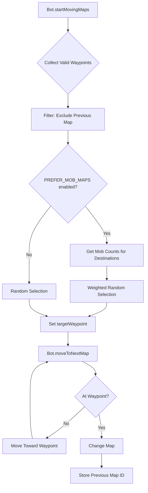

# Design Document: Bot Map Movement Improvement

## Overview

Cải thiện logic di chuyển map của Bot để hành vi tự nhiên hơn. Thêm các tính năng:
- Tránh quay lại map vừa rời khỏi
- Ưu tiên map có nhiều mob để săn
- Di chuyển mượt mà với tốc độ nhất quán
- Cấu hình linh hoạt qua BotConfig

## Architecture



## Components and Interfaces

### 1. Bot.java - Enhanced Map Movement

```java
// New fields
private int previousMapId = -1;  // Track last map for avoidance

// Enhanced methods
public void startMovingMaps()    // Add filtering and weighting logic
private void moveToNextMap()     // Store previousMapId on map change
private List<WayPoint> filterWaypoints(List<WayPoint> waypoints)  // New helper
private WayPoint selectWeightedWaypoint(List<WayPoint> waypoints) // New helper
private int getMobCountForMap(int mapId)  // New helper
```

### 2. BotConfig.java - New Configuration

```java
// New config fields
public static final boolean AVOID_PREVIOUS_MAP = true;
public static final boolean PREFER_MOB_MAPS = true;
public static final double MOB_WEIGHT_MULTIPLIER = 2.0;  // Higher = stronger preference
```

## Data Models

### WayPoint Selection Data

```java
// Internal structure for weighted selection
class WaypointCandidate {
    WayPoint waypoint;
    int mobCount;
    double weight;
}
```

### Bot State for Map Movement

```java
// Existing fields used
private int currentMapIndex;
private WayPoint targetWaypoint;
private long huntingStartTime;
private long huntingDuration;

// New field
private int previousMapId = -1;
```

## Correctness Properties

*A property is a characteristic or behavior that should hold true across all valid executions of a system-essentially, a formal statement about what the system should do. Properties serve as the bridge between human-readable specifications and machine-verifiable correctness guarantees.*

### Property 1: Previous Map Exclusion

*For any* bot with a valid previousMapId and multiple waypoint choices, the selected waypoint SHALL NOT lead to the previous map (unless it's the only valid option).

**Validates: Requirements 1.1**

### Property 2: Previous Map Tracking

*For any* successful map change, the bot's previousMapId SHALL equal the map ID the bot was on before the change.

**Validates: Requirements 1.3**

### Property 3: Mob-Weighted Selection Distribution

*For any* set of waypoints with different mob counts, over 100+ selections, waypoints leading to maps with more mobs SHALL be selected more frequently than those with fewer mobs (when PREFER_MOB_MAPS is enabled).

**Validates: Requirements 2.2**

### Property 4: Movement Speed Bounds

*For any* bot movement toward a waypoint, the movement distance per update SHALL be within [MOVE_SPEED_TO_WAYPOINT_MIN, MOVE_SPEED_TO_WAYPOINT_MAX].

**Validates: Requirements 3.1**

### Property 5: Destination Position Accuracy

*For any* map change via waypoint, the bot's new position SHALL match the waypoint's destination coordinates (goX, goY).

**Validates: Requirements 3.3**

## Error Handling

| Scenario | Handling |
|----------|----------|
| No valid waypoints found | Fall back to sequential map rotation |
| Previous map is only option | Allow it (fallback behavior) |
| Mob count unavailable | Use weight of 1.0 (equal chance) |
| Zone is null | Skip mob count check, use random |
| Invalid config values | Use default values |

## Testing Strategy

### Property-Based Testing

Sử dụng **jqwik** (Java property-based testing framework) để test các correctness properties.

Mỗi property test PHẢI:
- Chạy tối thiểu 100 iterations
- Tag với format: `**Feature: bot-map-movement-improvement, Property {number}: {property_text}**`
- Reference requirement clause mà property validates

### Unit Tests

- Test filterWaypoints với các edge cases (empty list, single waypoint, all same destination)
- Test selectWeightedWaypoint với mock mob counts
- Test previousMapId được update đúng sau map change

### Test Files

```
src/test/java/nro/bot/
├── BotMapMovementPropertyTest.java  // Property-based tests
└── BotMapMovementTest.java          // Unit tests
```

